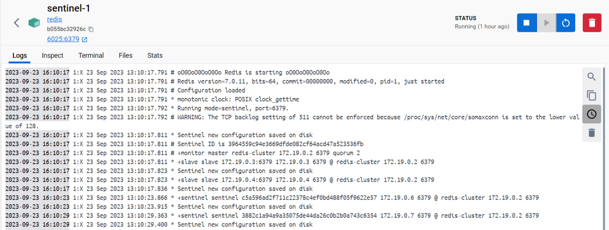
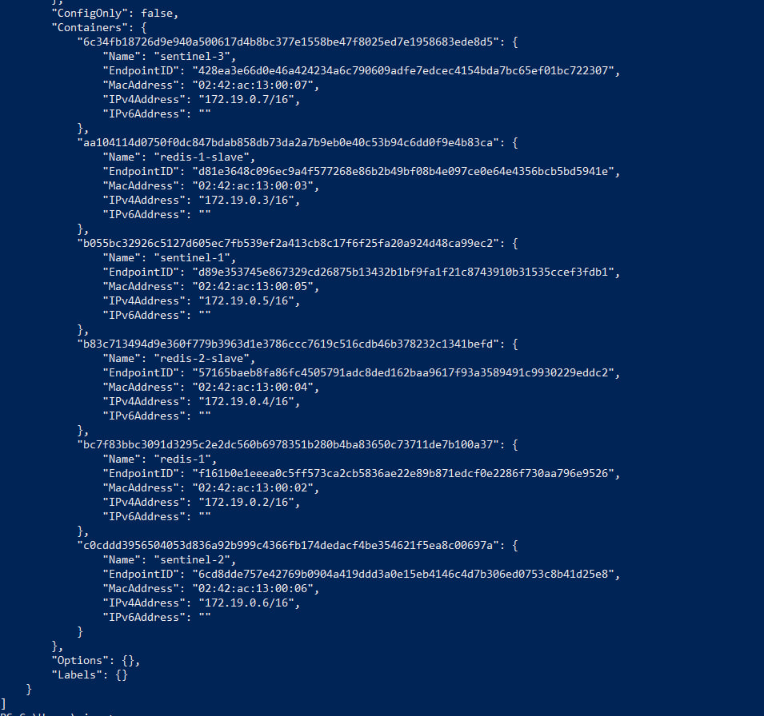
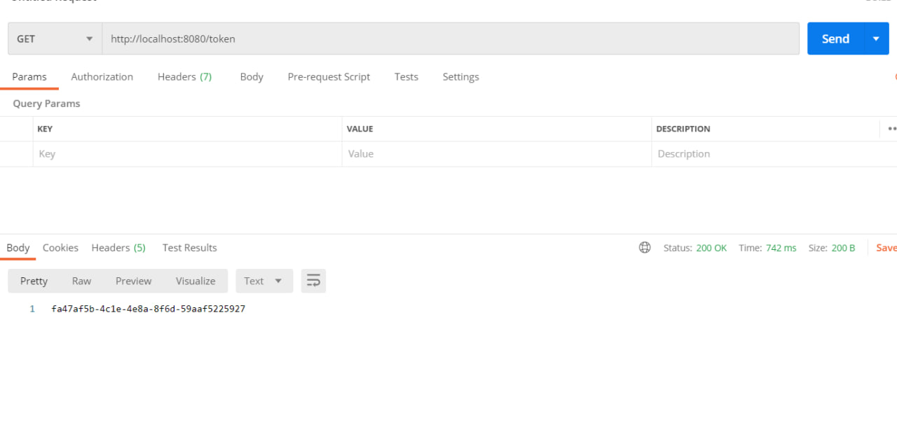
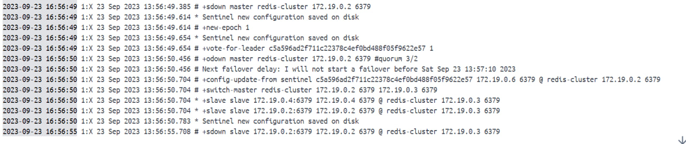
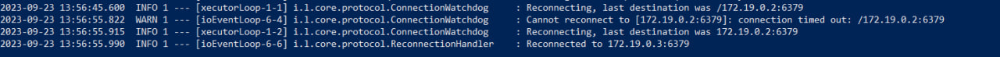
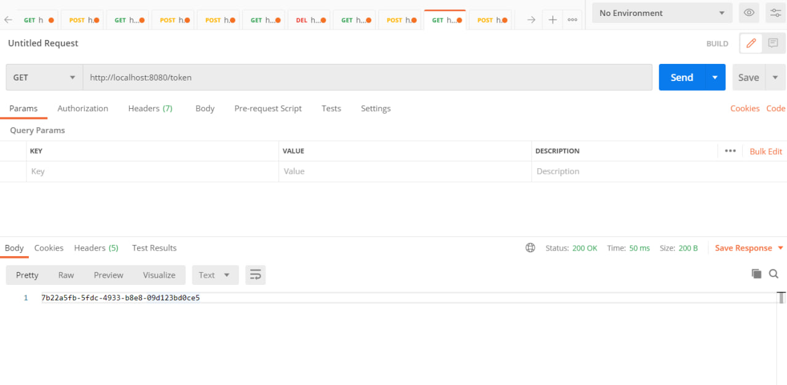

# auth
Project with the use of redis sentinel

To start Redis cluster <br />
---
Create folders node1, node-1-replica, node-1-replica2, sentinel, sentinel2, sentinel3 <br />
put redis.conf file in each folder. The content for node1 (master) is
````
port 6379

appendonly yes
appendfilename "node-1.aof"
dbfilename "dump-1.rdb"

maxmemory 128mb

#remove the last recently used (LRU) keys first
maxmemory-policy allkeys-lru
````
The content for replica is
````
port 6379

appendonly yes
appendfilename "node-1.aof"
dbfilename "dump-1.rdb"

maxmemory 128mb

#remove the last recently used (LRU) keys first
maxmemory-policy allkeys-lru

replicaof 172.19.0.2 6379
````
172.19.0.2 is the ip of master redis instance.<br />
The content for sentinel is
````
port 6379

sentinel deny-scripts-reconfig yes

sentinel monitor redis-cluster 172.19.0.2 6379 2

sentinel down-after-milliseconds redis-cluster 5000
sentinel failover-timeout redis-cluster 10000
````
172.19.0.2 is the ip of master redis instance.<br />

Create docker network <br />
---
````
docker network create spring-redis-sentinel
````
Run containers
---


````
docker inspect spring-redis-sentinel
````
shows container ip's which were defined in redis.conf files to bind

Redis sentinel
---
Logs in docker show that sentinels started and ready


Start auth application in docker
----
The sentinels' ips should be specified in application.properties.

Build image and run
````
docker build --tag=auth:latest .
````
````
docker run --rm --net spring-redis-network -p 8080:8080 --name auth auth:latest 
````
Call auth REST API to put token into redis
---
````
curl --location --request GET 'http://localhost:8080/token'
````

Endpoint generates token and puts it in redis

Simulating master failing
---
After master had failed, sentinels started to decide which replica is master now

Application reconnected

And still working


Useful links
---
- https://codingfullstack.com/java/spring-boot/spring-boot-redis-cluster/
